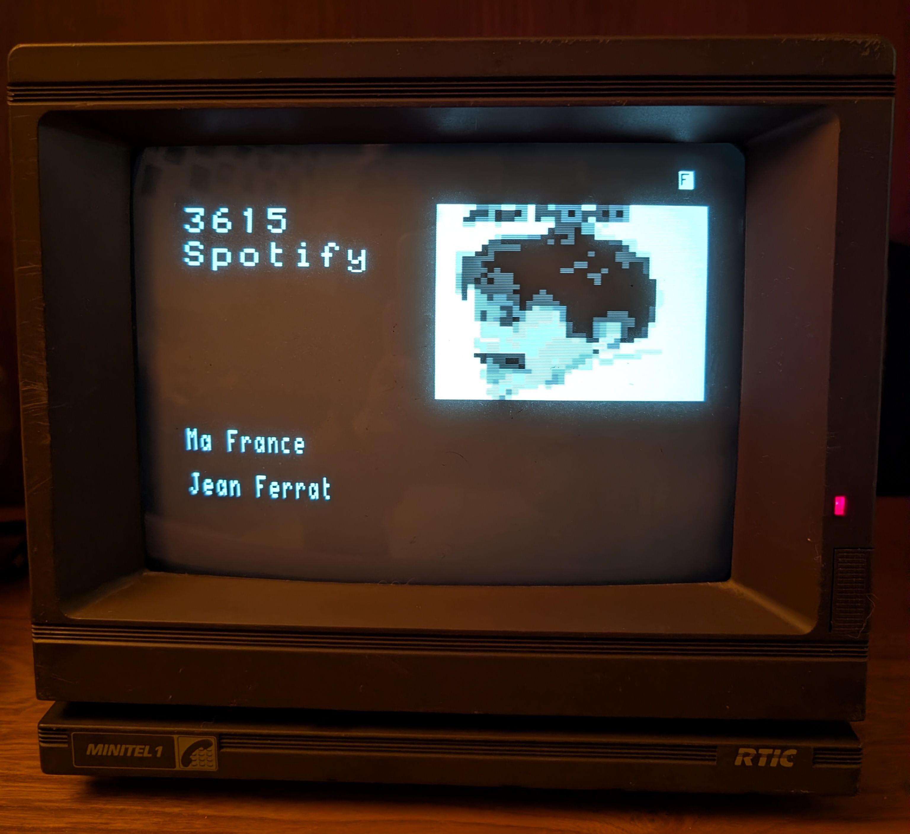

# 3615 Spotify


Ce projet a pour but d'afficher des informations à propos d'une piste Spotify.



Cela inclut la pochette, l'artiste et le titre.

L'API permettant de changer la piste affichée a été pensée pour être utilisée avec le superbe projet [Raspotify](https://dtcooper.github.io/raspotify/), en les utilisant ensemble, vous pourrez afficher chaque piste en train de se jouer et voir la pochette de l'album se dessiner petit à petit.


<video width="320" height="240" controls>
  <source src="doc/images/video_changement_piste.mp4" type="video/mp4">
Your browser does not support the video tag.
</video> 


## Installation

*Testé sur un raspberry 3B+ fonctionnant sur Debian 12 et un minitel 1 Alcatel*

Votre pi doit être branché en USB <-> Serial sur le port série à 5 broches du Minitel. Il est possible de les fabriquer assez simplement mais on en trouve aussi sur eBay.

Installer [uv](https://docs.astral.sh/uv/)

```bash
curl -LsSf https://astral.sh/uv/install.sh | sh
```

Cloner ce projet
```bash
git clone https://github.com/PierrickBrun/3615-spotify
cd 3615-spotify
```

Créer une application dans [Spotify Developers](https://developer.spotify.com), afin d'obtenir un Client ID et un Client Secret.


Modifier le ficher .env afin d'y renseigner les identifiants.

```bash
cat << EOF > .env
SPOTIFY_CLIENT_ID="CHANGEME"
SPOTIFY_CLIENT_SECRET="CHANGEME"
EOF
```

Copier le fichier `3615-spotify.service` dans le dossier `/etc/systems/system` et l'installer.
Modifier le fichier si besoin de changer le chemin

```bash
sudo cp deployment/3615-spotify.service /etc/systemd/system/3615-spotify.service
sudo vim /etc/systemd/system/3615-spotify.service
sudo systemctl daemon-reload
sudo systemctl enable 3615-spotify
sudo systemctl start 3615-spotify
```

## Connexion avec Raspotify

Vous devez avoir une installation de [Raspotify](https://dtcooper.github.io/raspotify/) dans le même réseau ou sur la même machine.

Copier le script dans le dossier bin (Avec le DynamicUser systemd utilisé par raspotify je n'ai pas trouvé d'autre solution)

```bash
sudo cp deployment/minitel_spotify.sh /bin/minitel_spotify_sh
```

Modifier la conf de raspotify pour appeler le script à chaque évènement Librespot

```bash
echo "\nLIBRESPOT_ONEVENT=minitel_spotify_sh" >> /etc/raspotify/conf
```

Redémarrer raspotify
```bash
sudo service raspotify restart
```

## Roadmap

 - Passer l'API en HTTPS avec certificat snakeoil
 - Faire un .deb pour faciliter le déploiement
 - Supporter d'autres plateformes que Spotify
 - Permettre de contrôler spotify depuis le minitel

## 
